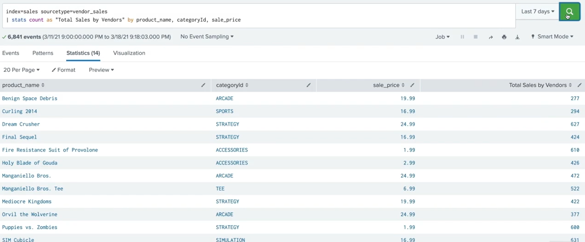
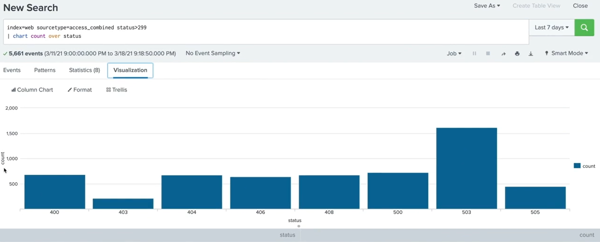
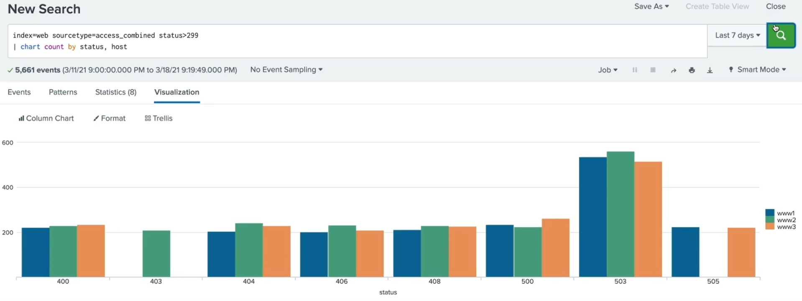
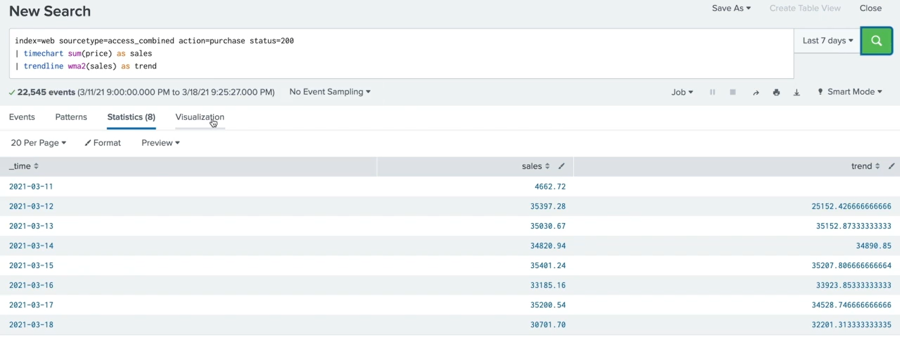

# Splunk

## Table of Contents {#contents}
- [Knowledge Objects](#knowledge-objects)
    - [Naming Conventions](#naming-conventions)
    - [Permissions](#permissions)
- [Using Fields](#using-fields)
    - [Field Operators](#field-operators)
    - [`| fields`](#fields-command)
    - [`| rename`](#rename-command)
    - [Index vs Search Time](#index-vs-searchtime)
    - [`| eval`](#eval-command)
    - [Field Extraction](#field-extraction)
    - [Enriching Data With Knowledge Objects](#enriching-data-ko)
- [Scheduling Reports & Alerts](#reports-alerts)
    - [Reports](#reports)
    - [Alerts](#alerts)

---

## Knowledge Objects {#knowledge-objects}
*Help you to discover and analyze your data.*

| Name | Functions |
|-------------|------------------------------------|
| Fields | Building blocks of the splunk search |
| Field extractions | You can extract fields from raw data using regex or delimiters |
| Field aliases | You can give alternate names to some fields to make your search more comfortable. |
| Calculated Fields | Perform calculations based on the values of existing fields. |
| Lookups | Additional fields can be added to your data using lookups. |
| Event types | 1. You can save your search as an Event Type.<br>2.Provide a way to help you categorize your data. |
| Tags | Save key:value pairs. Labels for data. |
| Workflow Actions | 1. Provide links within events that interact with external resources or narrow our search. <br>2. Use `GET` or `POST` method to pass information or pass information back to Splunk to perform a secondary search. |
| Reports | You can save searches that you run repeatedly to reports. |
| Alerts | Get a notification when certain conditions are met. |
| Macros | Frequently used searches saved to kind of functions where you can also pass arguments. |
| Data Models | 1.Hierarchically structured datasets that can consist of three types of datasets. Events. Searches. `AND`, `OR` transactions.<br>2. Explore data in a graphical interface. |

---

### Naming Conventions {#naming-conventions}
*Help understand what each knowledge object does.*
**6 segments of keys:**
1. Group
2. Type
3. Platform
4. category
5. Time
6. Description

**Example:**
*Security-Focused Workflow Action* for *Operations team* that returns *information about user's IP*: 
```
OPS_WFA_Network_Security_na_IPwhoisAction

OPS           = Group
WFA           = Type
Network       = Platform
Security      = Category
na            = Time (not time based in this case)
IPwhoisAction = Description
```

---

### Permissions {#permissions}
Private
: When `user` creates and object it is automatically set to private. It is only available to that  user.

Specific App
: `power user`, `admin` are allowed to create knowledge objects that will be shared will all users of an app.
: Can grant roles read and write permissions.

All Apps
: `admin` is the only user role that is allowed to make knowledge objects available to all apps.
: Can grant roles read and write permissions.

---

## Using Fields {#using-fields}
Selected Fields
: Fields of the utmost importance to you.

Interesting Fields
: Have value in at of 20% of the events.

`α` by a field name says the it's a string value.
`#` by a field name says that it's a numerical value.

---

### Field Operators {#field-operators}
*String and Numerical:*
- `=`, `!=`

*Only Numerical:*
- `>`, `>=`, `<`, `<=`

**`!=` vs `NOT`**
```
(index=web OR index=security) status!=200
# Returns fields where status code is not equal 200
```
```
(index=web OR index=security) NOT status=200
# Returns all fields that do not have field status which equals 200
```

**`IN`**
```
index=web status IN ("500", "503", "505") === index=web (status=500 OR status=503 OR status=505)
```

---

### `| fields` {#fields-command}
Used to include or exclude fields from your search.
```
index=web status IN ("500", "503", "505")
| fields +status
| stats count by status
```
`| fields` in this case makes the search more efficient 

Use `+` or `-` before a field name to include or exclude a field (default is `+`).
Filtering fields as early as possible is the best practice.

---

### `| rename` {#rename-command}
Used to rename field in your search.
You can give more meaningful or user friendly names to your fields.
==Once you've used rename command the original field name would no longer be available==
```
index=web status IN ("500", "503", "505")
| fields status
| stats count by status
| rename status as "HTTP Status", count as "Number of Events"
```

---

### Index vs Search Time {#index-vs-searchtime}
**Index**
When Splunk ingests data into the index a select number of fields are automaticaly extracted. 
These include `host`, `soucetype`, `source`.
Internal fields: `_time`, `_raw`.

**Search Time**
Splunk will automatically extract fields from your data.

---

### `| eval` {#eval-command}
```
index=network sourcetype=cisco_wsa_squid
| stats sum(sc_bytes) as Bytes by usage
| eval bandwidth = Bytes/1024/1024

# Here, eval takes Bytes field and divides it by 1024 twice.
# Field bandwidth will be created
# bandwidth will have megabytes based on bytes.
```

---

### Field Extraction {#field-extraction}
#### `| erex`
Automatic field extractor. We give it a sample of values and Splunk will try to extract what we want.
```
index=games soucetype=SimCubeBeta
| erex Character from field=_raw examples="pixie, Kooby"
```
We can see the regular expression Splunk uses by clicking on the job menu.

#### `| rex`
We can use regular expressions named captured groups to extract values at search time.
It can be used on field values or raw data.
Rex allows you to match multiple groups.
```
index=games sourcetype=SimCubeBeta
| rex field=_raw "^[0-9]{1,3}.[0-9]{1,3}.[0-9]{1,3}.[0-9]{1,3}$"

# Default for field argument is "_raw"
```

---

### Enriching Data With Knowledge Objects {#enriching-data-ko}
#### Calculated Fields
We can create a calculated field for example with bytes to convert it to megabytes and it will convert bytes to megabytes every time it finds bytes.
Make sure the field was extracted before you try to use it.

#### Field Aliases
If you have two different fields that return the same values, you can create aliases to make them look as one field.
Field aliases ==do not== replace or remove the original field names so we can search our data using either the original field name or the alias.

#### Lookups 
Allow you to add other fields and values to your events that are not a part of your index data. 

#### Order of Operations
Field Extractions :arrow_right: Field Aliases :arrow_right: Calculated Fields :arrow_right: Lookups :arrow_right: Event Types :arrow_right: Tags

---

## Scheduling Reports & Alerts {#reports-alerts}
### Reports {#reports}
It is basically a search string that runs on a scheduled intervals.

Runs on a scheduled interval. Every time a scheduled report is run it can automatically send an email or trigger different actions.
It can also be used to power dashboard panel.

Running concurrent reports, and the search behind them, can put a big demand on your system hardware, even if everything is configured to the recommended specs.

Splunk allow us to set **Schedule Priority**.
We can set a set **Schedule Window** when they may run.

**Schedule Priority** is only accessible to admin users.

**Priority levels:**
1. Default
2. Higher
3. Highest

Include a **Schedule Window** only if the report doesn't have to start at a specific time and you are okay with they delay.

| Action                                | Description                                           |
----------------------------------------|-------------------------------------------------------|
| Log Event                             | Send log event to Splunk receiver end point           |
| Output results to lookup              | Output the results of the search to a CSV lookup file |
| Output results to telemetry endpoint  | Custom action to output results to telemetry endpoint |
| Run a script                          | Invoke a custom script                                |
| Send email                            | Send an email notification to specified recipients    |
| Webhook                               | Generic `HTTP POST` to a specified URL                |

#### Managing Reports
We can edit: Search string, permissions, schedule, acceleration, summery indexing.
We can also disable, clone, embed, move, or delete a report.

- Users with the `power` role are able to display the report for themselves or to the other users of the app.
- Users with the `admin` role are able to display the report in all apps.

Embeding
: Getting html code to display a report on a web page.

Once embeding is enabled, we will no longer be able to edit attributes for the report.

We can add scheduled report to a dashboard.

---

### Alerts {#alerts}
- Based on searches that run on scheduled intervals or in real-time.
- Notify you when the results of a search meet defined conditions.
- Triggered when search is completed.

**Actions:**
1. Add to triggered alerts
    - We can set the severity of the alert
2. Log events
    - Sent to your splunk deployment for indexing.
3. Output to lookup
    - Create or update a csv lookup table.
4. Send to a telemetry endpoint
5. Run a script
    - Runs a file on your system (deprecated)
6. Send email
    - We can use splunk tokens to add dynamic data to emails.
7. Use a webhook
    - Custom callbacks. Allows to make an alert message pop up in a chat room.
8. Run a custom alert

Admin users can find prebuilt alert actions by clicking on **manage alert actions** link.

When an alert set to **private** only you (owner) can access (edit, view) it.
When an alert set to **Shared in App** the results will be displayed to all users of the app.

By default everyone has read access and `power user` has write access to the alert.

**Scheduled Alert Type** allows you to set a schedule and time range for the search to be run.
We can use `cron`.

**Read-Time Alert Type** will run the search continuously in the background.
As soon as search conditions are satisfied, an action is triggered.
Real-Time Alerts may impact your system performance.

**We can trigger an alert**
- per-result
- number of results
- number of hosts
- number of sources
- custom (spl)

We can use `Throttle` setting to suppress a few actions into one alert (like email), based on field values or time intervals.

#### Managing Alerts
**We can** edit alert, edit permissions, disable, clone, or delete an alert.
Alerts are **private** by default.
(Similar to reports)

---

## Visualizations
### Formatting Commands
#### `| fields`
Allows you to include or exclude specific fields from search results and fields list.
```
| fields product_name price
# To include fields
# Those will the only returned fields
```
```
| fields - product_name price
# To exclude fields
```
==Limiting fields can make your searches more efficient==

#### `| table`
Similar to fields command, but will display a table.
```
| table JESSIONID price product_name
# To draw a table
```
We can use `fields` command and `table` command together to improve efficiency of the search.

#### `| dedup`
Removes duplicate events from the results that share common values.
```
| fields JESSIONID price product_name
| table JESSIONID price product_name
| dedup JESSIONID

# We can dedup by several fields by just adding it to the same dedup command
```

#### `| addtotals`
Computes the sum of all numeric fields for each row and create a total column.
```
...
| chart sum(price) over product_name by VendorCountry
| addtotals col=True label="Total Sales" labelfield="product_name" fieldname="Total By Product"  
```

#### `| fieldformat`
Format the appearance of values without making a change to the underlying raw data.
```
index=sales sourcetype=vendor_sales product_name=*
| stats sum(price) as Total by product_name
| addtotals col=t label="Total Sales" labelfield="product_name"
| fieldformat Total = "$" + tostring(Total, "commas")
```

---

### Visualizing Data
Any search that returns statistical values can be viewed as a chart.

**Most visualizations require result structure as tables with at least to columns.**
The first columns provides the x-axis values and the second column provides the `y`.

#### Transforming commands
Order search results into a data table. They can be used for a statistical purposes.
We will need them to if we wanna transform our search results into visualization.
Take data through `|` symbol and transform it.

##### `| top`
*Finds the most common values of given fields in the results.*
Automatically returns *count* and *percent* columns.
We can use the `top` command for multiply fields at the same time.

Default `limit=10`, `limit=0` to get all results.
:point_down:To change names: 
`countfield = string`
`percentfield = string`

:point_down:To show or hide columns: 
`showcount = true/false`
`showperc = true/false`

:point_down:To add a row of count numbers for results not within the limits. 
`showother = true/false`
`otherstr = string`

```
index=sales sourcetype=vendor_sales
| top Vendor limit=5 showperc=false countfield="Number of Sales" showother=true
```

Using `by` with `top`:
```
index=sales sourcetype=vendor_sales
| top product_name by Vendor limit=3 showperc=false countfield="Number of Sales" showother=false
# It will show the top 3 product sales by each vendor
```

##### `| rare`
Same as `| top`, but it show the least common values.
You can also use `by` clause with this command.

##### `| stats`
To produce statistics from our search results. 
*Common `stats` functions:*
1. count
2. distinct count
3. sum
4. average
5. min
6. max
7. list
8. values

```
index=sales sourcetype=vendor_sales
| stats count
```
To change the name of the count column we use `as` clause.
```
...
| stats count as "Total Sales by Vendors"
```
We can add `by` clause to return the count for each field value of the named fields.
We can add any number of fields to split the count.
```
...
| stats count as "Total Sales by Vendors" by product_name, categoryId, sale_price
```


By adding a field as an argument to the `count` function we can get a count of the number of events where the field is present.
```
...
| stats count(field)
```

##### `| chart`
Takes 2 clause statements. `over` and `by`.
`over` tells splunk which fields you want to be on the x-axis.
Any `stats` function can be applied to `chart` command. 


We can split the data by which host the error occurred on. Adding `by host` to our search.
```
index=web sourcetype=access_combined status>299
| chart count over status by host
```

If two `by` clauses are used without using the `over` clause. The first field will be taken as the `over` clause.


We can add
```
usenull=false   # to remove null column
useother=false  # to remove other column
limit=5         # to adjust number of plotted series shown. Set 0 to display all products
```

##### `| timechart`
Performs stats aggregation against time. Time is always the x-axis.
Any `stats` function can be applied to `timechart` command.
To see a timeline of `vendor_sales`
```
index=sales sourcetype=vendor_sales
| timechart count
```
Add `by` clause to split the data by `product_name`. Only 1 values can be specified after `by` modifier. `limit`, `useother`, `usenull` are also available.

Use `span` to put the data in different time range groups.
```
index=sales sourcetype=vendor_sales
| timechart span=12hr sum(price) by product_name limit=0
```

##### `| trendline`
Computes moving averages of field values. 
Requires 3 arguments: 
1. Trendtype
    - simple moving average (sma)
    - exponential moving average (ema)
    - weighted moving average (wma)
2. You need to define a period of time to use for computing the trend.
    - Integer between 2 and 10 000
    - `wma2` - `wma100` - `wma10000`
    - The number is the number of days.
3. Define a field to calculated the trend from.
    - `wma2(field)` - `wma2(sales)`

```
index=web sourcetype=access_combined actions=purchase status=200
| timechart sum(price) as sales
| trendline wma2(sales) as trend
```


- `timechart`
- `top`
- `rare`
- `contingency`
- `highlight`

*Examples:*
```
index=* | stats count by purchase
```
---

## Notes from Notebook
### Data Model {#data-model}
A model to associate specific types to.
Data model :arrow_right: Data set :arrow_right: subset.

### CIM {#cim}
Common Information model.
A model. Data normalization.

### Lookup {#lookup}
Adding data from external sources.