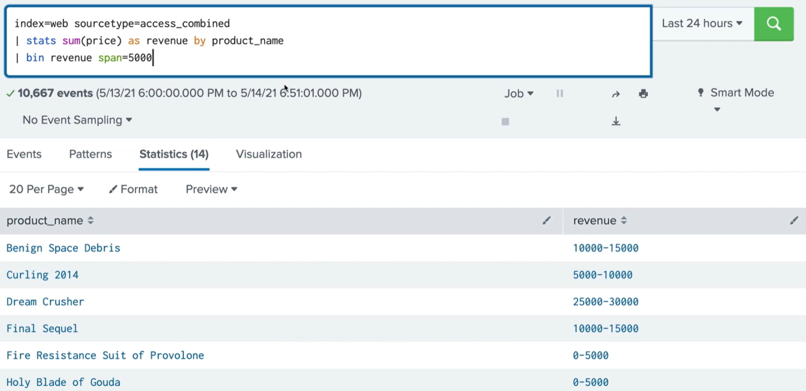
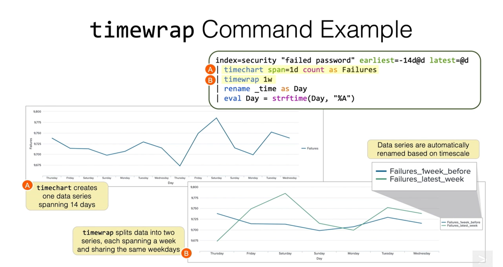

# Splunk
## Knowledge Objects
*Knowledge objects help you to discover and analyze your data.*

| Name | Functions |
|-------------|------------------------------------|
| Fields | Building blocks of the splunk search |
| Field extractions | You can extract fields from raw data using regex or delimiters |
| Field aliases | You can give alternate names to some fields to make your search more comfortable. |
| Calculated Fields | Perform calculations based on the values of existing fields. |
| Lookups | Additional fields can be added to your data using lookups. |
| Event types | 1. You can save your search as an Event Type.<br>2.Provide a way to help you categorize your data. |
| Tags | Save key:value pairs. Labels for data. |
| Workflow Actions | 1. Provide links within events that interact with external resources or narrow our search. <br>2. Use `GET` or `POST` method to pass information or pass information back to Splunk to perform a secondary search. |
| Reports | You can save searches that you run repeatedly to reports. |
| Alerts | Get a notification when certain conditions are met. |
| Macros | Frequently used searches saved to kind of functions where you can also pass arguments. |
| Data Models | 1.Hierarchically structured datasets that can consist of three types of datasets. Events. Searches. `AND`, `OR` transactions.<br>2. Explore data in a graphical interface. |

---

### Naming Conventions
*Help understand what each knowledge object does.*
**6 segments of keys:**
1. Group
2. Type
3. Platform
4. category
5. Time
6. Description

**Example:**
*Security-Focused Workflow Action* for *Operations team* that returns *information about user's IP*: 
```
OPS_WFA_Network_Security_na_IPwhoisAction

OPS           = Group
WFA           = Type
Network       = Platform
Security      = Category
na            = Time (not time based in this case)
IPwhoisAction = Description
```

---

### Permissions
Private
: When `user` creates and object it is automatically set to private. It is only available to that  user.

Specific App
: `power user`, `admin` are allowed to create knowledge objects that will be shared will all users of an app.
: Can grant roles read and write permissions.

All Apps
: `admin` is the only user role that is allowed to make knowledge objects available to all apps.
: Can grant roles read and write permissions.

---

## Using Fields
Selected Fields
: Fields of the utmost importance to you.

Interesting Fields
: Have value in at of 20% of the events.

`α` by a field name says the it's a string value.
`#` by a field name says that it's a numerical value.

---

### Field Operators
*String and Numerical:*
- `=`, `!=`

*Only Numerical:*
- `>`, `>=`, `<`, `<=`

**`!=` vs `NOT`**
```
(index=web OR index=security) status!=200
# Returns fields where status code is not equal 200
```
```
(index=web OR index=security) NOT status=200
# Returns all fields that do not have field status which equals 200
```

**`IN`**
```
index=web status IN ("500", "503", "505") === index=web (status=500 OR status=503 OR status=505)
```

---

### `| fields`
Used to include or exclude fields from your search.
```
index=web status IN ("500", "503", "505")
| fields +status
| stats count by status
```
`| fields` in this case makes the search more efficient 

Use `+` or `-` before a field name to include or exclude a field (default is `+`).
Filtering fields as early as possible is the best practice.

---

### `| rename`
```
...| rename <field> as <newfield>
```
When including spaces or special characters in filed names, use double quotes, `" "`

Used to rename field in your search.
You can give more meaningful or user friendly names to your fields.
==Once you've used rename command the original field name would no longer be available==
```
index=web status IN ("500", "503", "505")
| fields status
| stats count by status
| rename status as "HTTP Status", count as "Number of Events"
```

- We can rename multiply fields within the same `rename` command
```
index=web sourcetype=access_combined
| table clientip, action, productId, status
| rename productId As ProductID, 
action AS "Customer Action",
status AS "HTTP Status"
```

- We can use wildcards to rename multiply fields that match a pattern.
```
index=web sourcetype=access_combined
| table productId, product_name
| rename product* AS PROD*
| table PROD*
```


---

### Index vs Search Time 
**Index**
When Splunk ingests data into the index a select number of fields are automatically extracted. 
These include `host`, `sourcetype`, `source`.
Internal fields: `_time`, `_raw`.

**Search Time**
Splunk will automatically extract fields from your data.

---

### `| eval`
```
...| eval <field1>=<expression1>[, <field2>=<expression2>]
```

- Calculates an expression and puts the resulting values into a new field or overwrites an existing field
- Fields created by `eval` can be reused in the search pipeline
- Extremely useful command that supports a vast assortment of functions for performing specific tasks
- Can exist as a nested function in certain scenarios

==No change to your data is permanent==

| Type          | Operators             |
|---------------|-----------------------|
| arithmetic    | `+ - * / %`           |
| concatenation | `+ .`                 |
| Boolean       | `AND OR NOT XOR`        |
| comparison    | `< > <= >= != = LIKE` |

```
index=network sourcetype=cisco_wsa_squid
| stats sum(sc_bytes) as Bytes by usage
| eval bandwidth = Bytes/1024/1024

# Here, eval takes Bytes field and divides it by 1024 twice.
# Field bandwidth will be created
# bandwidth will have megabytes based on bytes.
```

```
index=network sourcetype=cisco_wsa_squid
| stats sum(sc_bytes) as bytes by usage
| eval bandwidth = bytes/(1024*1024)
| eval bandwidth = round(bandwidth, 2)
```

**Commonly used `eval` functions:**
<table>
  <tr>
    <th>Category</th>
    <th>Function Syntax</th>
    <th>Description</th>
  </tr>
  <tr>
    <td rowspan="2">Mathematical</td>
    <td><code>round(X, Y)</code></td>
    <td>Rounds X to Y decimal places, otherwise returns X as a whole number</td>
  </tr>
  <tr>
    <td><code>pow(X, Y)</code></td>
    <td>Returns X to the power of Y</td>
  </tr>
  <tr>
    <td rowspan="3">Statistical</td>
    <td><code>max(X, ...)</code></td>
    <td>Takes an arbitrary number of arguments and returns the maximum</td>
  </tr>
  <tr>
    <td><code>min(X, ...)</code></td>
    <td>Takes an arbitrary number of arguments and returns the minimum</td>
  </tr>
  <tr>
    <td><code>random()</code></td>
    <td>Takes no arguments and returns a random integer</td>
  </tr>
</table>

There are **11** categories of evaluation functions:
Conversion, Comparison and Conditional, Mathematical, Informational, Statistical, Text, ext.

`eval` can also be used as a function with the `stats` command.
```
index=security sourcetype=linux_secure vendor_action=*
| stats count(eval(vendor_action="Accepted")) as Accepted, 
count(eval(vendor_action="Failed")) as Failed,
count(eval(vendor_action="session opened")) as SessionOpened
```
- Requires an as clause to rename the field.

---

### Field Extraction 
#### `| erex`
Automatic field extractor. We give it a sample of values and Splunk will try to extract what we want.
```
index=games sourcetype=SimCubeBeta
| erex Character from field=_raw examples="pixie, Kooby"
```
We can see the regular expression Splunk uses by clicking on the job menu.

#### `| rex`
We can use regular expressions named captured groups to extract values at search time.
It can be used on field values or raw data.
Rex allows you to match multiple groups.
```
index=games sourcetype=SimCubeBeta
| rex field=_raw "^[0-9]{1,3}.[0-9]{1,3}.[0-9]{1,3}.[0-9]{1,3}$"

# Default for field argument is "_raw"
```

---

### Enriching Data With Knowledge Objects
#### Calculated Fields
We can create a calculated field for example with bytes to convert it to megabytes and it will convert bytes to megabytes every time it finds bytes.
Make sure the field was extracted before you try to use it.

#### Field Aliases
If you have two different fields that return the same values, you can create aliases to make them look as one field.
Field aliases ==do not== replace or remove the original field names so we can search our data using either the original field name or the alias.

#### Lookups 
Allow you to add other fields and values to your events that are not a part of your index data. 

#### Order of Operations
Field Extractions :arrow_right: Field Aliases :arrow_right: Calculated Fields :arrow_right: Lookups :arrow_right: Event Types :arrow_right: Tags

---

## Scheduling Reports & Alerts 
### Reports 
It is basically a search string that runs on a scheduled intervals.

Runs on a scheduled interval. Every time a scheduled report is run it can automatically send an email or trigger different actions.
It can also be used to power dashboard panel.

Running concurrent reports, and the search behind them, can put a big demand on your system hardware, even if everything is configured to the recommended specs.

Splunk allow us to set **Schedule Priority**.
We can set a set **Schedule Window** when they may run.

**Schedule Priority** is only accessible to admin users.

**Priority levels:**
1. Default
2. Higher
3. Highest

Include a **Schedule Window** only if the report doesn't have to start at a specific time and you are okay with they delay.

| Action                                | Description                                           |
----------------------------------------|-------------------------------------------------------|
| Log Event                             | Send log event to Splunk receiver end point           |
| Output results to lookup              | Output the results of the search to a CSV lookup file |
| Output results to telemetry endpoint  | Custom action to output results to telemetry endpoint |
| Run a script                          | Invoke a custom script                                |
| Send email                            | Send an email notification to specified recipients    |
| Webhook                               | Generic `HTTP POST` to a specified URL                |

#### Managing Reports
We can edit: Search string, permissions, schedule, acceleration, summery indexing.
We can also disable, clone, embed, move, or delete a report.

- Users with the `power` role are able to display the report for themselves or to the other users of the app.
- Users with the `admin` role are able to display the report in all apps.

Embedding
: Getting html code to display a report on a web page.

Once embedding is enabled, we will no longer be able to edit attributes for the report.

We can add scheduled report to a dashboard.

---

### Alerts {#alerts}
- Based on searches that run on scheduled intervals or in real-time.
- Notify you when the results of a search meet defined conditions.
- Triggered when search is completed.

**Actions:**
1. Add to triggered alerts
    - We can set the severity of the alert
2. Log events
    - Sent to your splunk deployment for indexing.
3. Output to lookup
    - Create or update a csv lookup table.
4. Send to a telemetry endpoint
5. Run a script
    - Runs a file on your system (deprecated)
6. Send email
    - We can use splunk tokens to add dynamic data to emails.
7. Use a webhook
    - Custom callbacks. Allows to make an alert message pop up in a chat room.
8. Run a custom alert

Admin users can find prebuilt alert actions by clicking on **manage alert actions** link.

When an alert set to **private** only you (owner) can access (edit, view) it.
When an alert set to **Shared in App** the results will be displayed to all users of the app.

By default everyone has read access and `power user` has write access to the alert.

**Scheduled Alert Type** allows you to set a schedule and time range for the search to be run.
We can use `cron`.

**Read-Time Alert Type** will run the search continuously in the background.
As soon as search conditions are satisfied, an action is triggered.
Real-Time Alerts may impact your system performance.

**We can trigger an alert**
- per-result
- number of results
- number of hosts
- number of sources
- custom (spl)

We can use `Throttle` setting to suppress a few actions into one alert (like email), based on field values or time intervals.

#### Managing Alerts
**We can** edit alert, edit permissions, disable, clone, or delete an alert.
Alerts are **private** by default.
(Similar to reports)

---

## Visualizations
### Formatting Commands
#### `| fields`
Allows you to include or exclude specific fields from search results and fields list.
```
| fields product_name price
# To include fields
# Those will the only returned fields
```
```
| fields - product_name price
# To exclude fields
```
==Limiting fields can make your searches more efficient==

#### `| table`
Similar to fields command, but will display a table.
```
| table JESSIONID price product_name
# To draw a table
```
We can use `fields` command and `table` command together to improve efficiency of the search.

#### `| dedup`
Removes duplicate events from the results that share common values.
```
| fields JESSIONID price product_name
| table JESSIONID price product_name
| dedup JESSIONID

# We can dedup by several fields by just adding it to the same dedup command
```

#### `| addtotals`
Computes the sum of all numeric fields for each row and create a total column.
```
...
| chart sum(price) over product_name by VendorCountry
| addtotals col=True label="Total Sales" labelfield="product_name" fieldname="Total By Product"  
```

#### `| fieldformat`
Format the appearance of values without making a change to the underlying raw data.
```
index=sales sourcetype=vendor_sales product_name=*
| stats sum(price) as Total by product_name
| addtotals col=t label="Total Sales" labelfield="product_name"
| fieldformat Total = "$" + tostring(Total, "commas")
```

---

### Visualizing Data
Any search that returns statistical values can be viewed as a chart.

**Most visualizations require result structure as tables with at least to columns.**
The first columns provides the x-axis values and the second column provides the `y`.

#### Transforming commands
Order search results into a data table. They can be used for a statistical purposes.
We will need them to if we wanna transform our search results into visualization.
Take data through `|` symbol and transform it.

##### `| top`
*Finds the most common values of given fields in the results.*
Automatically returns *count* and *percent* columns.
We can use the `top` command for multiply fields at the same time.

Default `limit=10`, `limit=0` to get all results.
:point_down:To change names: 
`countfield = string`
`percentfield = string`

:point_down:To show or hide columns: 
`showcount = true/false`
`showperc = true/false`

:point_down:To add a row of count numbers for results not within the limits. 
`showother = true/false`
`otherstr = string`

```
index=sales sourcetype=vendor_sales
| top Vendor limit=5 showperc=false countfield="Number of Sales" showother=true
```

Using `by` with `top`:
```
index=sales sourcetype=vendor_sales
| top product_name by Vendor limit=3 showperc=false countfield="Number of Sales" showother=false
# It will show the top 3 product sales by each vendor
```

##### `| rare`
Same as `| top`, but it show the least common values.
You can also use `by` clause with this command.

##### `| stats`
To produce statistics from our search results. 
*Common `stats` functions:*
1. count
2. distinct count
3. sum
4. average
5. min
6. max
7. list
8. values

```
index=sales sourcetype=vendor_sales
| stats count
```
To change the name of the count column we use `as` clause.
```
...
| stats count as "Total Sales by Vendors"
```
We can add `by` clause to return the count for each field value of the named fields.
We can add any number of fields to split the count.
```
...
| stats count as "Total Sales by Vendors" by product_name, categoryId, sale_price
```


By adding a field as an argument to the `count` function we can get a count of the number of events where the field is present.
```
...
| stats count(field)
```

```
index=security sourcetype=linux_secure
| stats count(vendor_action) as ActionEvents, count as TotalEvents
```

##### `| chart`
Takes 2 clause statements. `over` and `by`.
`over` tells splunk which fields you want to be on the x-axis.
Any `stats` function can be applied to `chart` command. 


We can split the data by which host the error occurred on. Adding `by host` to our search.
```
index=web sourcetype=access_combined status>299
| chart count over status by host
```

If two `by` clauses are used without using the `over` clause. The first field will be taken as the `over` clause.


We can add
```
usenull=false   # to remove null column
useother=false  # to remove other column
limit=5         # to adjust number of plotted series shown. Set 0 to display all products
```

##### `| timechart`
Performs stats aggregation against time. Time is always the x-axis.
Any `stats` function can be applied to `timechart` command.
To see a timeline of `vendor_sales`
```
index=sales sourcetype=vendor_sales
| timechart count
```
Add `by` clause to split the data by `product_name`. Only 1 values can be specified after `by` modifier. `limit`, `useother`, `usenull` are also available.

Use `span` to put the data in different time range groups.
```
index=sales sourcetype=vendor_sales
| timechart span=12hr sum(price) by product_name limit=0
```

##### `| trendline`
Computes moving averages of field values. 
Requires 3 arguments: 
1. Trendtype
    - simple moving average (sma)
    - exponential moving average (ema)
    - weighted moving average (wma)
2. You need to define a period of time to use for computing the trend.
    - Integer between 2 and 10 000
    - `wma2` - `wma100` - `wma10000`
    - The number is the number of days.
3. Define a field to calculated the trend from.
    - `wma2(field)` - `wma2(sales)`

```
index=web sourcetype=access_combined actions=purchase status=200
| timechart sum(price) as sales
| trendline wma2(sales) as trend
```


---

### Generating Maps
Splunk can pull geographic data from your machine data.
**Marker Maps** plot geographic coordinates as interactive markers on a world map.

#### `| iplocation`
Used to lookup and add location information from a third party database to an event.
City, Country, Region, Latitude, Longitude fields can be added to events that contains external ip addresses.
Those fields can be used later with the `geostats` command to create a map.
```
index=security sourcetype=linux_secure action=success src_ip!=10.*
| iplocation src_ip
```
==Some location information may not be available for particular ip addresses.==
If an ip address is not found in a third party database, no fields will be added to the event.

#### `| geostats`
Helps aggregate geographical data for use on a map.
**Uses the functions as the stats commands.**
```
index=sales sourcetype=vendor_sales
| geostats latfield=VendorLatitude longfield=VendorLongitude count
```
add `by` argument to split your data.
**Unlike `stats` command** the geostats command only accepts one by argument.
To control the column `count` the `globallimit` argument can be used.
```
index=sales sourcetype=vendor_sales
| geostats latfield=VendorLatitude longfield=VendorLongitude count by product_name globallimit=4
```
```
index=security sourcetype=linux_secure action=success src_ip!=10.*
| iplocation src_ip
| geostats latfield=lat longfield=lon count 
```

---

**Choropleth Maps** shading to show relative metrics for predefine geographic regions.
In order to use this kind of maps we will need `.kmz` - Keyhole Markup Language File that defines region boundaries.
Splunk ships with 2 KMZ files:
`geo_us_states.kmz` for the US and `geo_countries.kmz` for the countries of the worlds. However other KMZ files can be used.

#### `| geom`
To prepare our events for use in a choropleth.
Adds a field to our events that includes geographical data structures that match polygons on our map.
When we use `geom` we have to specify the name of the KMZ file and the featureIdField argument.
```
index=sales sourcetype=vendor_sales VendorID>=5000 AND VendorID<=5055
| stats count as Sales by VendorCountry
| geom geo_countries featureIdField=VendorCountry
```

---

### Single Value Visualizations
Displays a single integer
There are many options for formatting depending on the value.
We can use `timechart` command to add a trend and sparkline to the visualization.
We can use `by` and `Trellis` to see each value by each result.
We can use `gauge` command  to set rages using the Splunk Search Language.
```
index=web sourcetype=access_combined action=purchase status=200
| stats sum(price) as Total
| gauge Total 0 100000 200000 300000
```
Once color format is set it stays persistent over different types of visualization.

### Visual Formatting
```
index=web sourcetype=access_combined file=*
| chart sum(bytes) over host by file
```
We can highlight the high and low values in the table by setting data overlay. 
We can show or hide *Totals* and *Percentages* by formatting through user interface.

**Chart Overlay** is very handy when using trendline.
```
index=web sourcetype=access_combined actions=purchase status=200
| timechart sum(price) as sales
| trendline wma2(sales) as trend
```

---

## Working with Time
### Searching with Time
When n event is ingested its timestamp is stored in the `_time` field which is used to create a timeline in Splunk user interface.

The `_time` field is stored with the event in the index.

**Default time fields in Splunk:**
1. `date_hour`
2. `date_mday`
3. `date_minute`
4. `date_month`
5. `date_second`
6. `date_wday`
7. `date_year`
8. `date_zone`

Timestamps are expressed in *Unix* or *epoch* time. Translated during the search operation process.
All events are sorted by time, that's why time is the most efficient filter.

**The timestamp that you see is adjusted to your local timezone** as long as the timezone set in the account settings.

**Time range options:**
- Presets
- Relative
- Real-time
    - Can impact overall performance
- Date Range
- Date & Time Range
- Advanced

Let's assume now is 09:45 April 1st 2021
| Relative Time Modifiers | Search |
|-------------------------------|--------|
| -30m@h                        | Looks back to 09:00:00 on April 1st 2021  |
| earliest=-h@h                 | Rounds down to 08:00:00 on April 1st 2021 |
| earliest=-mon@mon latest=@mon | Looks for events from 00:00:00 on March 1st 2021 to 00:00:00 on April 1st 2021 |
| earliest=-7d@d                | Looks for events from 00:00:00 on March 25th (7 days before April 1st) to 09:45:00 on April 1st 2021 |
|earliest=@d+3h                 | Looks for events from 03:00:00 to 09:45:00 on April 1st 2021 |

`@` symbol "snaps" to the time unit you specify and will always round down to the nearest specified unit.

| Relative Time Modifiers | \<timeUnit>                                    |
|-------------------------|------------------------------------------------|
| Current date & time     | now                                            |
| Second                  | s, sec, secs, second, seconds                  |
| Minute                  | m, min, minute, minutes                        |
| Hour                    | h, hr, hrs, hour, hours                        |
| Day                     | d, day, days                                   |
| Week                    | w, week, weeks                                 |
| Days of the week        | w1 (Monday)...w6 (Saturday), w7 or w0 (Sunday) |
| Month                   | mon, month, months                             |
| Quarter                 | q, qtr, qtrs, quarter, quarters                |
| Year                    | y, yr, yrs, year, years                        |

We can use `earliest` and `latest` in the search line.
```
index=security sourcetype=linux_secure fail* password earliest=-5m@m latest=now
```
The specified time in the search line **is more important** than the time that is set in the Time Range Picker.

Time shown by Splunk UI may different from the raw data if the timezone is different.
If Splunk does not find time in the raw data it will assign the time of creating the index to all of the events.
```
index=sales sourcetype=vendor_sales earliest=-2d@d latest=@d date_hour>=2 AND date_hour<5
| bin span=1h _time
| stats sum(price) as "Hourly Sales" by _time
| eval Hour = strftime(_time, "%b %d, %I %p") # month, day of the month, hour, am/pm
| table Hour, "Hourly Sales"
```

```
...| bin _time [span=<int><timescale>] [as <newfield>]
```
The `bin` command is used to help us bucket up our events.
`bin` Command: **`<timescale>`** Values
| Time Scale     | Syntax                                |
|----------------|---------------------------------------|
| `<sec>`        | s \| sec \| secs \| second \| seconds |
| `<hr>`         | m \| min \| mins \| minute \| minutes |
| `<day>`        | d \| day \| days                      |
| `<month>`      | mon \| month \| months                |
| `<subseconds>` | us \| ms \| cd \| ds                  |

```
index=web sourcetype=access_combined
| stats sum(price) as revenue by product_name
| bin revenue span=5000
```


```
index=web sourcetype=access_combined
| stats sum(price) as revenue by product_name
| bin revenue span=5000
| stats list(product_name) as product_name by revenue
| eval revenue = "$".revenue
```

---

### Formatting Time
We can define how time is formatted in the search result by using time functions of the `eval` command.
#### `eval` Date and Time Functions
```
...| eval <field>=<expression1>[, <field>=<expression2>]
```
- Calculates an expression and puts the resulting value into a new or existing field which can be reused in the search pipeline.
- Extremely powerful and useful command that supports a vast assortment of functions
- Can exist as an expression

**`now()`**: returns the time a search was started
```
...| eval field1 = now()
```

**`time()`**: returns the time an event was processed by `eval` command
```
...| eval field1 = time()
```

**`relative_time`**
```
...| eval field1 = relative_time(X,Y)
```
- Returns an epoch timestamp relative to a supplied time
- **X** is a number, representing desired time in epoch seconds
- **Y** is a relative time specifier
- Relative time specifiers use time unit abbreviations such as:
    - `s=seconds m=minutes h=hours d=days w=week mon=months y=year`

```
...| eval yesterday = relative_time(now(), "-1d@h")
```

**Example:**
```
index=sales sourcetype=vendor_sales
| timechart span=1h sum(price) as hourly_sales
| eval formatted_time = strftime(_time, "%b %d, %I %p")
```

We can use `strptime` to get UNIX time from formatted time.
```
index=systems sourcetype=system_info asctime=*
| eval NewAsctime = strptime(asctime, "%Y-%m-%d &H:%M:%S,%N")
| table asctime, NewAsctime
```

---

### Using Time Commands
#### `| timechart`
- Performs statistical aggregation against time.
```
...| timechart <stats-func>(<field>) by <field>
      [span=<int><timescale>] [limit=<int>]
```

#### `| timewrap`
Can compare data over a specific time period, such as day-over-day or month-over-month
Typically going to follow the `timechart` command
```
...| timewrap [<int>]<timescale>
```
It will allow us to compare specific time periods to each other.
*For example looking at number of password failures for the last two weeks looking at each week by week.*
```
index=security "failed password" earliest=-14d@d latest=@d
| timechart span=1d count as Failures
| timewrap 1w
| rename _time as Day
| eval Day = strftime(Day, "%A")
```


---

### Working with Time Zones
- Remember, `date_*` fields do not reflect your local time, but are the values of time/date directly from the raw events.
- To determine your time zone:
    1. In **Preferences**, set **Time Zone** to **Default System Timezone**
    2. Run a search over the last 15 minutes
    3. Read the event timestamps and compare with you local time

---

## Statistical Processing
Data Series
: Sequence of related data points that are plotted in a visualization.

**3 Types of data series:**
- *Single-series:* Compares values of of a single data category.
- *Multi-series:* Compares values of 2 or more data categories.
- *Time-series:* Compares values over time. Can be single or multi-series.

Transforming commands can be used in searches to organize our results into a statistical table containing a data series that can be visualized. 

### `| sort`
```
...| sort (-|+) <field> [limit=<int> | <int>]
```
- Sorts in ascending order by default
- Limit results returned with the `limit` option or just include a number
- Determines field type then determines sorting type:
    - Alphabetic strings = lexicographic sort
        - Upper case letters appear before lowercase.
    - Numeric = numerical sort
    - Combination = lexicographic or numeric sort based on first character.

```
index=sales sourcetype=vendor_sales Vendor=Bea*
| dedup Vendor, VendorCity
| table Vendor, VendorCity, VendorStateProvince, VendorCountry
| sort - Vendor
```

### `| chart`
```
...| chart <stats-func>(<wc-field>) over <row-split> [by <column-split>] [span=<int><timescale>][limit=<int>] [useother=<bool>] [usenull=<bool>]
```
- Returns results in a table format that can be displayed as a visualization
- Specify the y-axis with `<stats-func>(<wc-field>)`
    - `<wc-field>` is a field with numeric values; supports wildcards
    - `<stats-func>` is a supported statistical function
- Specify x-axis with `over <row-split>`
- Further split data by including `by <column-split>`
- Control behavior with `span`, `useother`, and `usenull`

**`chart` Command: `split` Fields**
- Use `over <row-split>` to specify the x-axis and create a single-series data series
- Further split results and create a multi-series data series by adding `by <column-split>`
    - Splits results of `<stats-func>(<wc-field>)`
    - May alter the range of the y-axis
- Results can only be split using 2 fields
- Alternative syntax: `by` clause with 2 arguments
```
...| chart <stats-func>(<wc-field>) by <row-split> <column-split>
```
*Example 1:*
```
# single-series
index=security sourcetype=linux_secure
| chart count by vendor_action
```
```
# multi-series
index=security sourcetype=linux_secure
| chart count by vendor_action user
```

*Example 2:*
```
# single-series
index=sales sourcetype=vendor_sales VendorID<4000
| chart count over VendorCountry
```
```
# multi-series
index=sales sourcetype=vendor_sales VendorID<4000
| chart count over VendorCountry by product_name
```

By adding `limit=5` it would show only top 5 values for `product_name` appear as their own individual column. Any values that are less frequent than 5 would go to the `other` column.

**`chart` Command: `span` Option**
- If the `<row-split>` field (x-axis) is numeric, use the `span` option with the `chart` command to group events into buckets
- Splunk shifts overlapped values to the higher grouping.

For example the status code of 400 would be bucketed in a 400-500 range.
```
index=web sourcetype=access_combined
| chart span=100 count over status by host
```

### `| timechart`
Performs stats aggregations against time. Time is always the x-axis. With this command we can return time-series chart or table.
- `<stats-func>(<field>)` applies a function to a single field and populates the y-axis.
    - if using the `count` function, a field does not need to be specified.

**`timechart` Command**
```
...| timechart <stats-func>(<field>) by <split-by-field> [span=<int><timescale>] [limit-<int>]
```
`timechart` supports only single additional split.

*Example 1:*
```
index=network sourcetype=cisco_wsa_squid
| timechart count
```
*Example 2:*
```
index=network sourcetype=cisco_wsa_squid
| timechart count by usage
```

**`timechart` Command: `span` Option**
- The `timechart` command "buckets" the values of the `_time` field based on time range you use if no `span` argument is specified
- Examples:
    1. Last 60 minutes defaults to `span=1m`
    2. Last 24 hours defaults to `span=30m`

```
index=security sourcetype=linux_secure vendor_action=*
| timechart span=15m count by vendor_action
```

---

### Transforming Commands Summary
| Feature                            | `chart`      | `timechart`  | `stats` |
|------------------------------------|--------------|--------------|---------|
| `by` clause arguments              | 2            | 1            | many    |
| Limit series shown                 | `limit=int`  | `limit=int`  | NA      |
| Filter other series                | `useother=t` | `useother=t` | NA      |
| Filter null values                 | `usenull=t`  | `usenull=t`  | NA      |
| Set values groups along the x-axis | `span`       | `span`       | NA      |

Result of `stats` command is usually meant to be a table when results of `chart` and `timechart` commands are often meant to be visualizations.

---

## Terms
Data Series
: Sequence of related data points that are plotted in a visualization.

Data Model
: A model to associate specific types to.
: Data model :arrow_right: Data set :arrow_right: subset.

Lookup
: Adding data from external sources.

CIM
: Common Information Model.
: A model. Data normalization.

